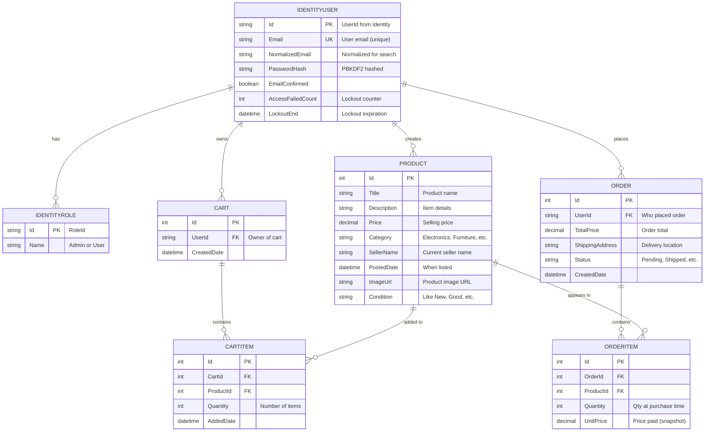
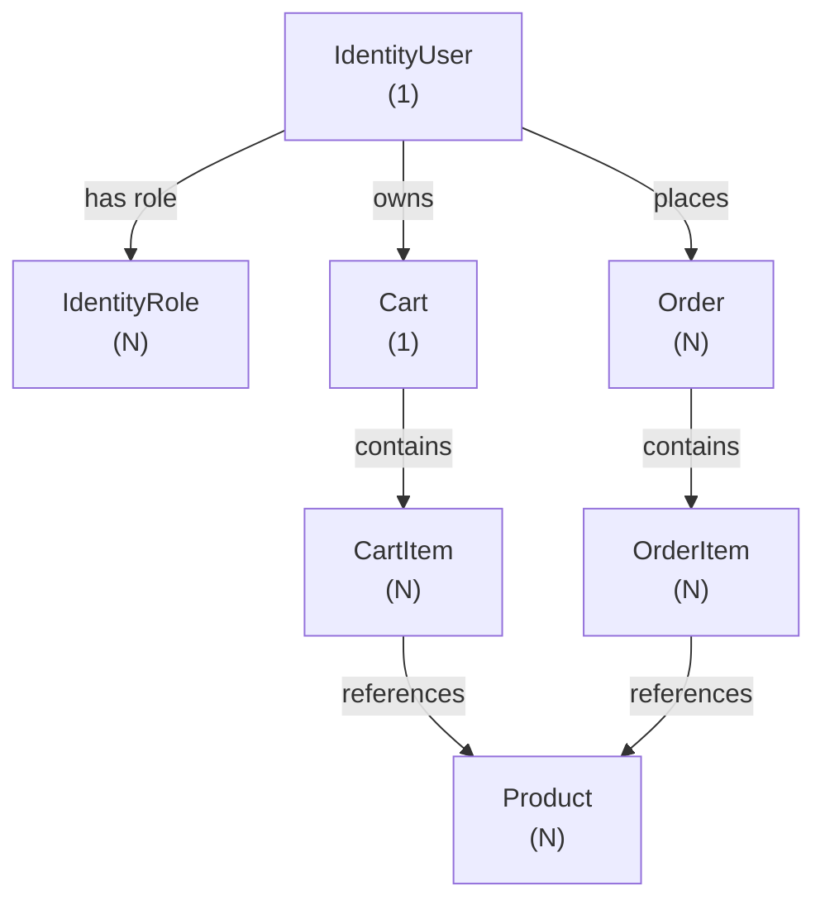

# Database Schema Design (Updated for Milestone 6)

This schema represents the **actual, implemented** data model for Buckeye Marketplace. The schema supports product browsing, user authentication, shopping cart, checkout, order history, and admin operations.

## Entity Relationship Diagram (Mermaid)

## Entities and Attributes

### IdentityUser (from ASP.NET Core Identity)
**Purpose**: User authentication, login, password management, roles

| Attribute | Type | Notes |
|-----------|------|-------|
| Id | string (PK) | Unique user identifier |
| Email | string (UK) | User email, must be unique |
| NormalizedEmail | string | Uppercase version for case-insensitive search |
| PasswordHash | string | PBKDF2-hashed password (never plain text) |
| EmailConfirmed | boolean | Whether email has been verified |
| AccessFailedCount | int | Increments on failed login; resets after successful login |
| LockoutEnd | datetime | NULL if not locked; otherwise timestamp when lockout expires |

**Constraints**: Email is unique; password must be 8+ chars with 1 uppercase, 1 digit, 1 special char

---

### IdentityRole (from ASP.NET Core Identity)
**Purpose**: Define user roles for authorization

| Attribute | Type | Notes |
|-----------|------|-------|
| Id | string (PK) | Role identifier |
| Name | string | "Admin" or "User" |

**Seeded roles**: Admin (can manage products/orders), User (can browse and checkout)

---

### Product
**Purpose**: Product catalog; supports browsing, searching, filtering

| Attribute | Type | Notes |
|-----------|------|-------|
| Id | int (PK) | Unique product identifier |
| Title | string | Product name (e.g., "MacBook Air") |
| Description | string | Item details and condition notes |
| Price | decimal(18,2) | Selling price in dollars |
| Category | string | Category name (e.g., "Electronics") |
| SellerName | string | Name of seller (for UI display) |
| PostedDate | datetime | When product was listed |
| ImageUrl | string | URL to product image |
| Condition | string | Condition enum ("Like New", "Excellent", "Good", "Very Good") |

**Constraints**: Price > 0; Title and Description not null

**Seeded data**: 8 sample products on database creation

---

### Cart
**Purpose**: Shopping cart for a logged-in user; one per user

| Attribute | Type | Notes |
|-----------|------|-------|
| Id | int (PK) | Cart identifier |
| UserId | string (FK) | References IdentityUser.Id |
| CreatedDate | datetime | When cart was created |

**Relationship**: One Cart per User; one User can have one Cart

---

### CartItem
**Purpose**: Individual items in a shopping cart

| Attribute | Type | Notes |
|-----------|------|-------|
| Id | int (PK) | Cart item identifier |
| CartId | int (FK) | References Cart.Id |
| ProductId | int (FK) | References Product.Id |
| Quantity | int | Number of items (>= 1) |
| AddedDate | datetime | When added to cart |

**Constraint**: Quantity >= 1; one CartItem per (CartId, ProductId) pair (no duplicates)

---

### Order
**Purpose**: Completed purchases; order summary and status

| Attribute | Type | Notes |
|-----------|------|-------|
| Id | int (PK) | Order identifier |
| UserId | string (FK) | References IdentityUser.Id (who placed order) |
| TotalPrice | decimal(18,2) | Sum of all OrderItems |
| ShippingAddress | string | Delivery address |
| Status | string | "Pending", "Shipped", "Delivered", etc. |
| CreatedDate | datetime | When order was placed |

**Constraint**: TotalPrice >= 0; Status is predefined enum

---

### OrderItem
**Purpose**: Individual products in a completed order (snapshot of cart items)

| Attribute | Type | Notes |
|-----------|------|-------|
| Id | int (PK) | Order item identifier |
| OrderId | int (FK) | References Order.Id |
| ProductId | int (FK) | References Product.Id |
| Quantity | int | Number of units ordered |
| UnitPrice | decimal(18,2) | Price per unit at time of purchase (snapshot) |

**Constraint**: Quantity >= 1; UnitPrice is historical (not linked to current Product.Price)

---

## Relationships Summary

## How the Schema Supports Features

| Feature | Entities Involved | How |
|---------|-------------------|-----|
| **Product Browsing** | Product | List all products, filter by category/price/condition |
| **User Registration** | IdentityUser, IdentityRole | Create user, assign "User" role |
| **User Login** | IdentityUser | Validate email/password; issue JWT token |
| **Shopping Cart** | Cart, CartItem, Product | Add/remove/update items in user's cart |
| **Checkout** | Cart, CartItem, Order, OrderItem, Product | Convert CartItems to Order + OrderItems |
| **Order History** | Order, OrderItem, Product | Show user their past orders with items |
| **Admin Product Mgmt** | Product, IdentityRole | Create/edit/delete products (Admin role required) |
| **Admin Order Mgmt** | Order, OrderItem, IdentityRole | View all orders, update status (Admin role required) |

## Connection to Implementation

This schema is defined in [backend/BuckeyeMarketplaceApi/Data/MarketplaceContext.cs](../../backend/BuckeyeMarketplaceApi/Data/MarketplaceContext.cs):
- Uses Entity Framework Core 8 with Fluent API for relationships
- IdentityUser and IdentityRole come from `IdentityDbContext<IdentityUser, IdentityRole, string>`
- Migrations tracked in source control for reproducibility
- InMemory database for tests; SQL Server for dev/production

  

<h3>Entity Relationship Diagram</h3>

 

  

<h3>Entities and Their Roles</h3>

<h4>Users</h4>

Supports registration, login, user profiles, seller identity, buyer identity, and seller response status.

<h4>Products</h4>

Supports the product catalog, listing cards, required listing fields, and filtering by condition, price, and category.

<h4>Categories</h4>

Supports student-focused item categories and enables category-based filtering.

<h4>Threads</h4>

Represents a conversation between a buyer and seller about a specific product. Supports in-app messaging and seller response status.

<h4>Messages</h4>

Stores individual messages within a thread, enabling simple chat between buyer and seller.

<h4>MeetupDetails</h4>

Stores proposed pickup times and safe meetup locations associated with a specific thread.

  

<h3>Relationship Mappings</h3>

Users 1 &mdash; N Products

Categories 1 &mdash; N Products

Users 1 &mdash; N Threads (as buyer)

Users 1 &mdash; N Threads (as seller)

Products 1 &mdash; N Threads

Threads 1 &mdash; N Messages

Threads 1 &mdash; N MeetupDetails

  

<h3>How the Schema Supports User Stories</h3>

<strong>User Story #1 (Basic Search Bar):</strong> Products and Categories enable searching by name, category, and other listing fields.

<strong>User Story #2 (Filters for Condition, Price, Category):</strong> Products store condition and price, while Categories support category filtering.

<strong>User Story #3 (Listing Cards With Photos and Details):</strong> Products provide the required listing fields needed to display listing cards.

<strong>User Story #4 (Required Listing Fields):</strong> Products represent all required listing information (title, description, condition, price, category).

<strong>User Story #5 (In-App Messaging):</strong> Threads and Messages enable buyer–seller communication tied to a specific product.

  

<h3>Connection to Milestone 1</h3>

This schema directly supports the needs identified in the personas and journey map. Maya’s need for trustworthy, clear listings is supported through Products and Categories. Alex’s need for fast, organized browsing is supported through Products, Categories, and filtering. Jordan’s frustration with unreliable communication is addressed through Threads and Messages, which structure buyer–seller interactions. Safety concerns from the journey map are supported through MeetupDetails, which store safe meetup locations and pickup times. Overall, the schema ensures that the technical design aligns with the user-centered insights from Milestone 1.

