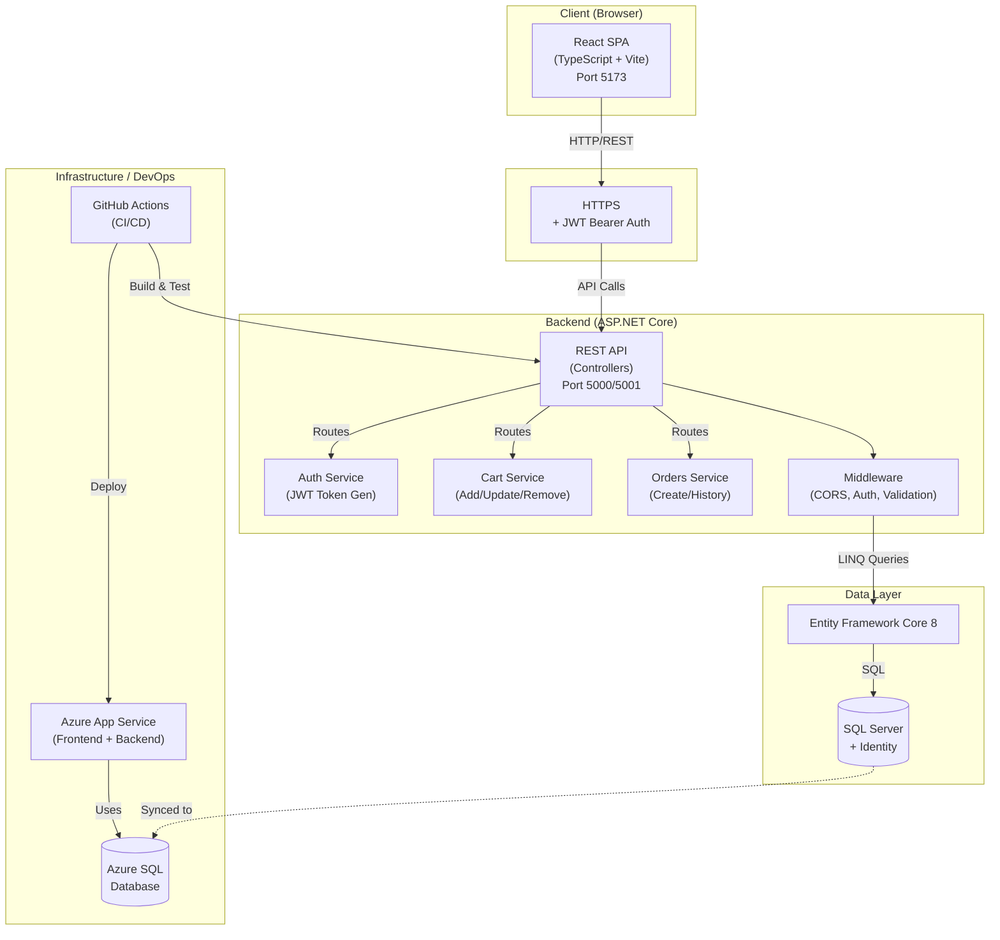
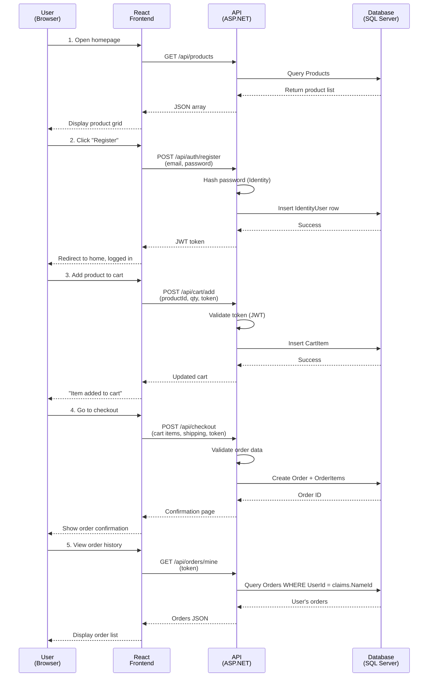
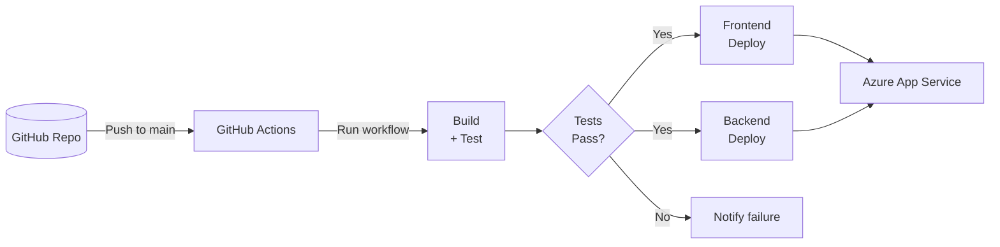

# Buckeye Marketplace System Architecture

This system architecture shows how the React frontend, ASP.NET Core API, and SQL database work together to support the full marketplace flow: browsing → authentication → cart → checkout → orders, plus admin operations.

## High-Level Architecture Diagram

## Component Responsibilities

### Frontend (React)
- **UI Layer**: Pages (ProductList, ProductDetail, Login, Register, Checkout, OrderHistory, AdminPages)
- **State Management**: Cart context (useReducer), Auth context (useReducer), local form state (useState)
- **HTTP Client**: Axios with JWT token interceptor
- **Routing**: React Router for SPA navigation
- **Styling**: CSS Modules (no global CSS, no inline styles)

### Backend API (ASP.NET Core)
- **Controllers**: ProductsController, CartController, AuthController, OrdersController, AdminProductsController, AdminOrdersController
- **Authentication**: JWT Bearer token validation on protected endpoints
- **Authorization**: Role-based policies (User, Admin)
- **Data Validation**: FluentValidation on all request DTOs
- **ORM**: Entity Framework Core for database abstraction
- **Swagger/OpenAPI**: Development-only API documentation at `/swagger`

### Database (SQL Server + Identity)
- **User Management**: ASP.NET Core Identity (hashed passwords, roles, claims)
- **Core Entities**: Product, Cart, CartItem, Order, OrderItem
- **Constraints**: Foreign keys, unique constraints, NOT NULL checks
- **Seeding**: Admin role and test data on startup

### DevOps (GitHub Actions → Azure)
- **CI**: Automated build and test on every push
- **CD**: Automated deployment to Azure App Service on successful tests
- **Secrets**: JWT key and connection strings stored securely (never in code)
- **Monitoring**: Azure Application Insights, GitHub Actions logs

## Data Flow: Complete User Journey

## Security Highlights

- **JWT Authentication**: Stateless token-based auth; token validated on every protected endpoint
- **Password Hashing**: PBKDF2 via ASP.NET Identity (never stored plain text)
- **SQL Injection Prevention**: All queries use Entity Framework LINQ (no raw SQL)
- **XSS Prevention**: React escapes all content by default; no `dangerouslySetInnerHTML`
- **CORS**: Configured to allow only frontend origin
- **HTTPS**: Enforced in production; development uses HTTP for local testing
- **Secrets Management**: JWT key in user-secrets (local) / Azure Key Vault (production); never in code

## Deployment Pipeline

For detailed decision rationale, see [Architecture Decision Records](./architecture-decisions.md).
