# Buckeye Marketplace — User Documentation

This document is split into two parts:
- User Guide
- Admin Guide

---

## Part A: User Guide

### 1. How to Browse Products

When you first visit the marketplace, you'll see the Product Catalog homepage.

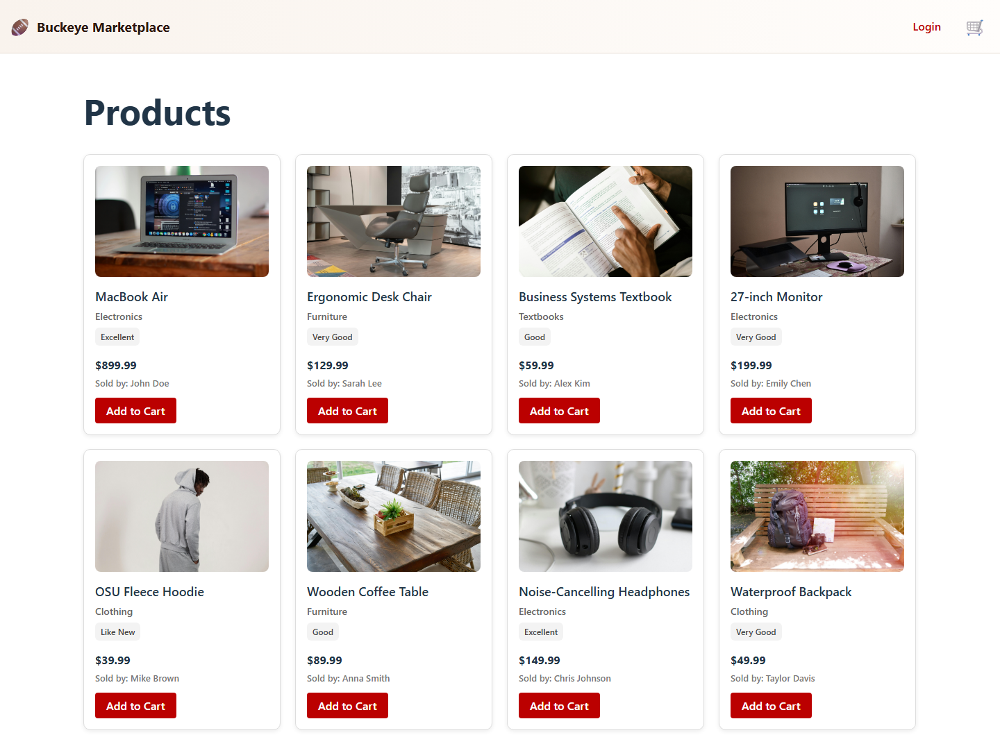

From here, you can:
- Scroll through available items
- See title, price, condition, and seller details
- Open a product to continue shopping flow

### View Product Details

Click a product card from the catalog to open its details page (example: `/products/3`).

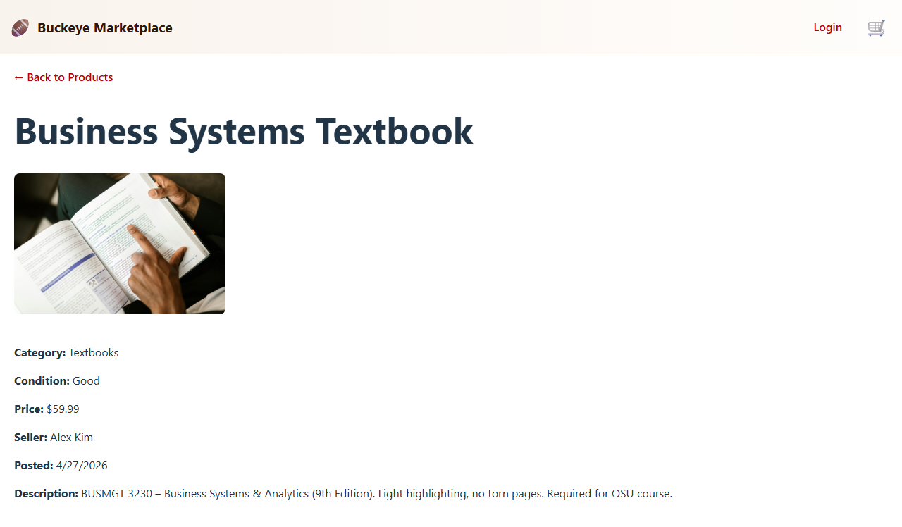

On this page, you can:
- Review full product description
- Confirm condition and seller info
- Check price and item image
- Add the selected product to cart

### 2. How to Create an Account and Login

#### Registering for an account

Click Register in the header and complete the form:

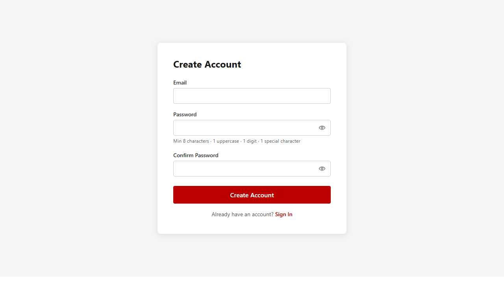

Steps:
1. Enter your email address
2. Create a password (8+ chars, 1 uppercase, 1 number, 1 special character)
3. Click Register
4. You are redirected to the homepage as an authenticated user

#### Logging in

If you already have an account, click Login:

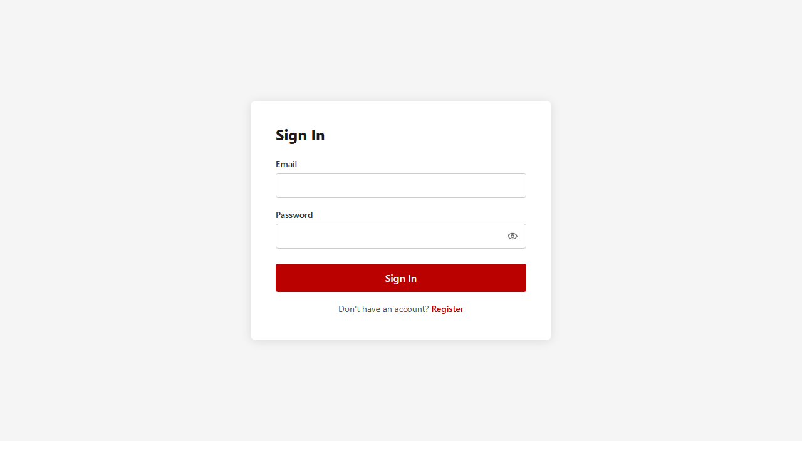

Steps:
1. Enter email and password
2. Click Login
3. You are redirected to the homepage and can use cart/checkout features

Test account:
- Email: `testing@test.com`
- Password: `Testing1!`

### 3. How to Add Items to Cart

#### Adding from product list

Click Add to Cart on a product card:

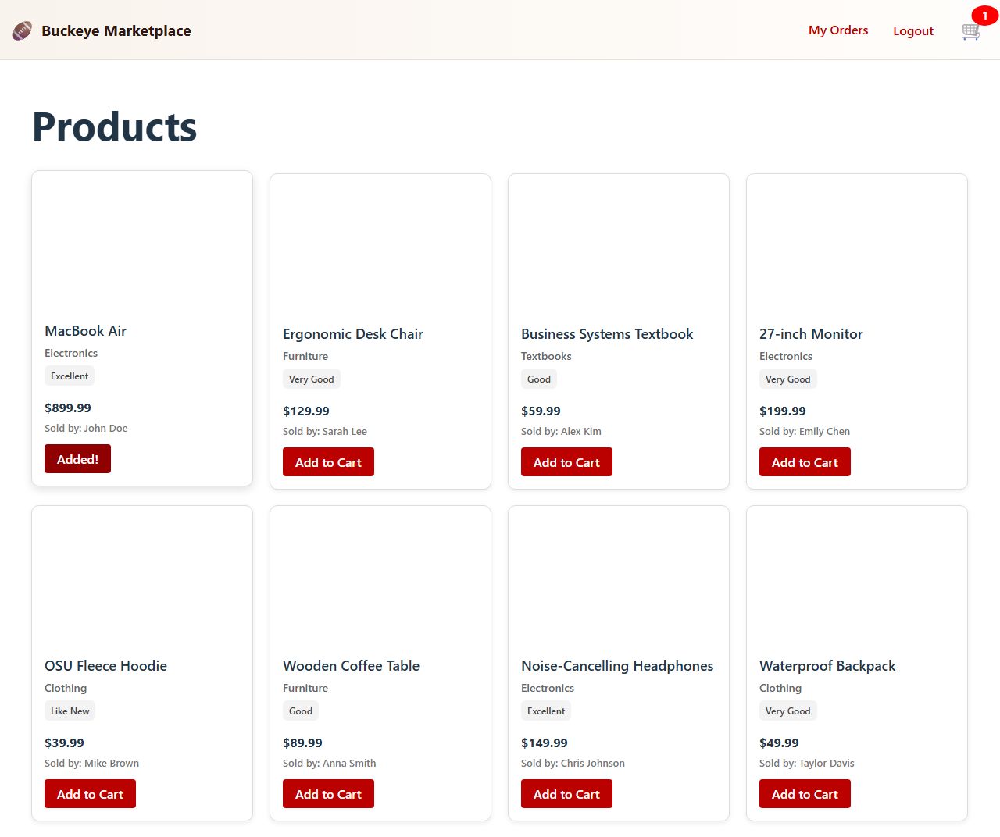

The UI shows Added! feedback when the item is successfully added.

#### Viewing your cart

Click Cart in the header to open the cart page:

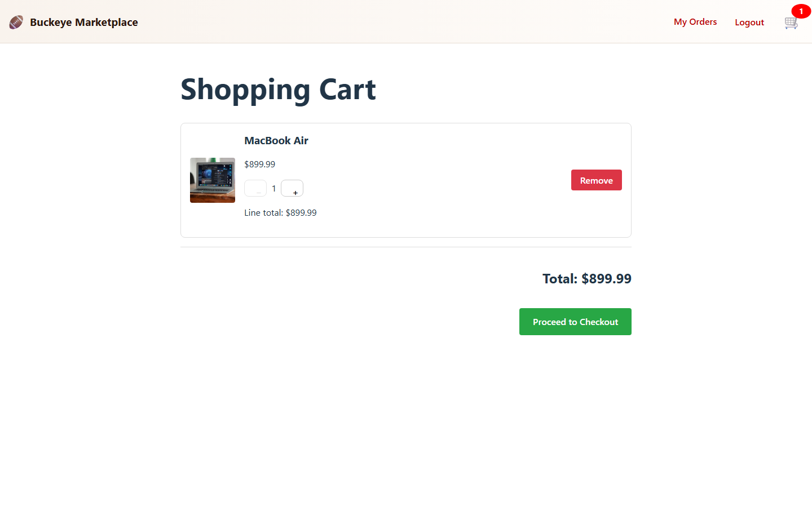

In cart, you can:
- See all added items
- Increase/decrease quantity
- View subtotal and total
- Remove individual items
- Clear the entire cart

### 4. How to Place an Order

Click Proceed to Checkout from cart:

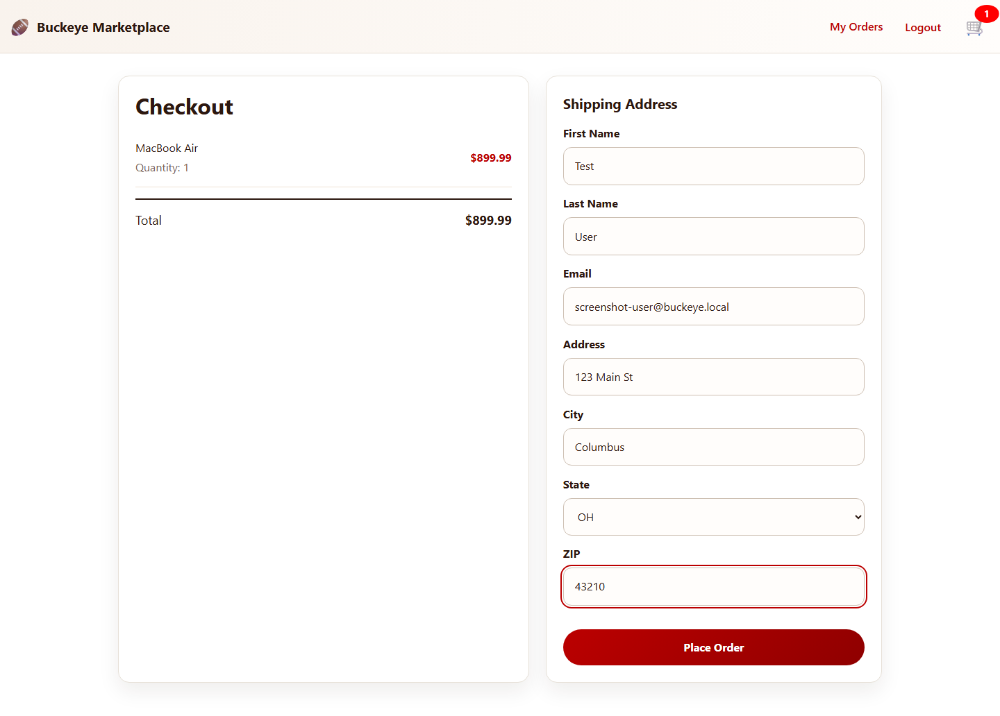

Complete shipping details and submit order.

After successful checkout, you reach confirmation:

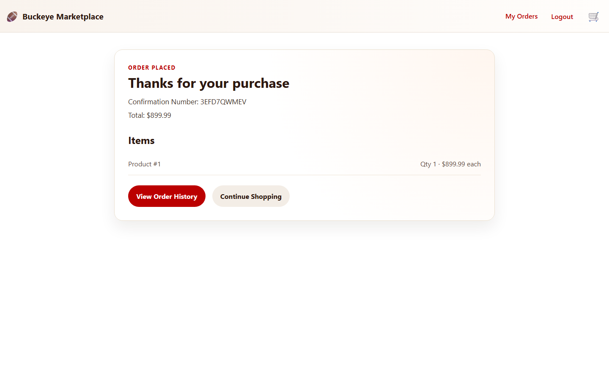

Confirmation includes order id, items, totals, and shipping address.

### 5. How to View Order History

Open Orders from the header:

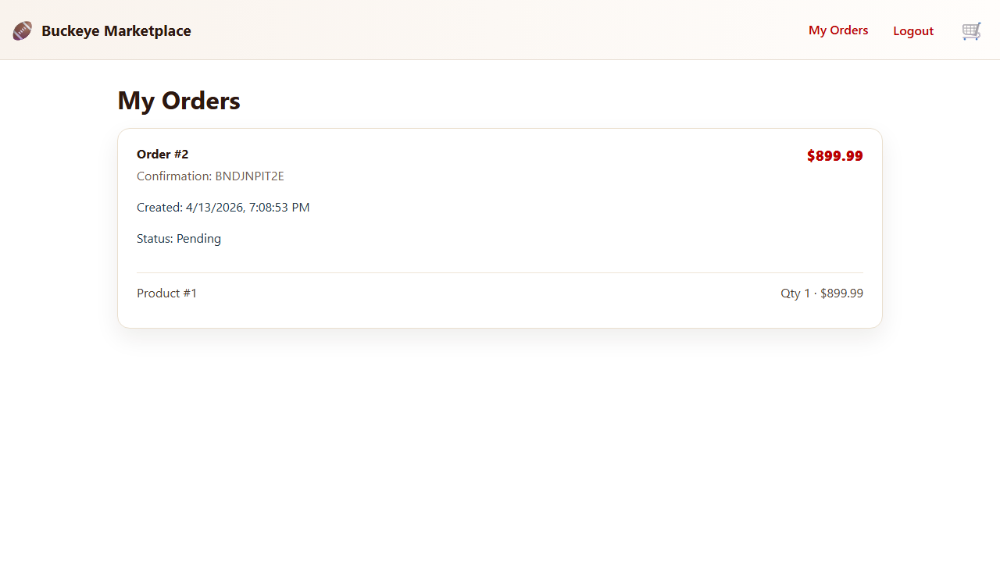

Each order shows:
- Order ID
- Date
- Items and quantities
- Total
- Status (Pending/Processing/Shipped/Delivered/Cancelled)

---

## Part B: Admin Guide

Admin-only features appear after logging in as an admin user.

Admin test account:
- Email: `admin@buckeye.local`
- Password: `Admin@1234!`

### 1. How to Manage Products

Navigate to Admin > Products:

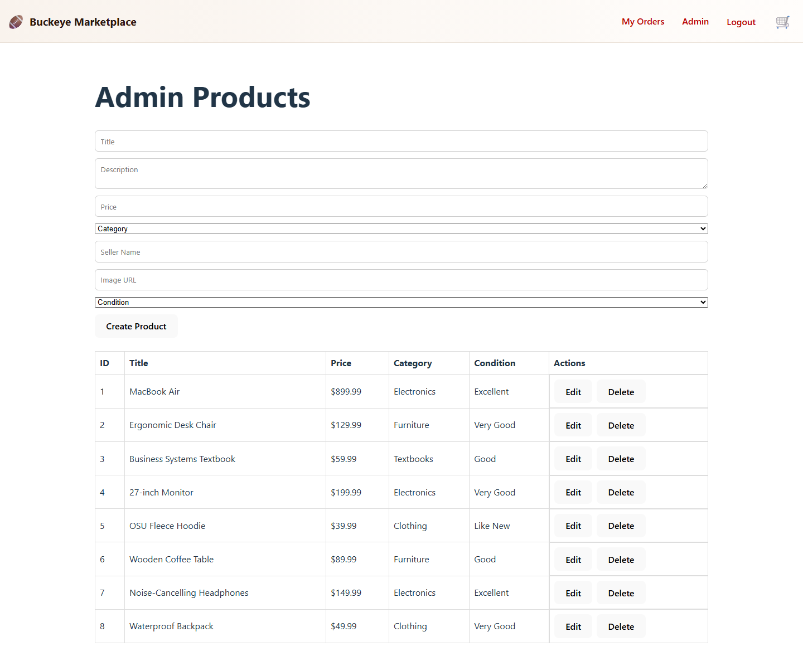

Admin product actions:
- Create product
- Edit product (name, price, description, condition)
- Delete product
- Verify changes in the admin table

### 2. How to Update Order Status

Navigate to Admin > Orders:

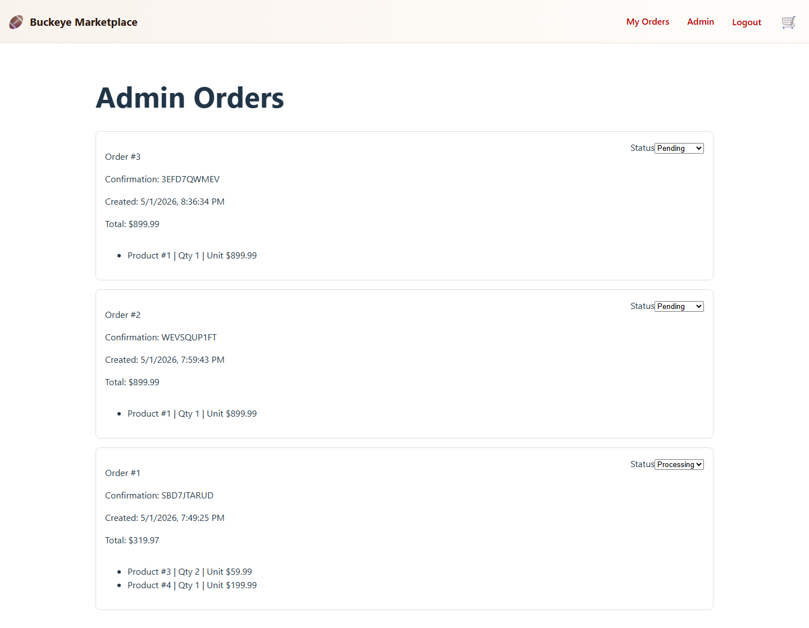

Admin order actions:
- View all customer orders
- Update status (Pending -> Processing -> Shipped -> Delivered)
- Confirm status updates persist in the order table
